# 📱 Phone Inventory Management App

Ứng dụng **Quản lý kho điện thoại** được xây dựng bằng **Python** và **Streamlit**, giúp quản lý sản phẩm, khách hàng, nhà cung cấp, và các hoạt động nhập/xuất kho một cách hiệu quả.

---
## Bước 1 : MySQL Community Server và MySQL Workbench để tạo ra database cho ứng dụng:
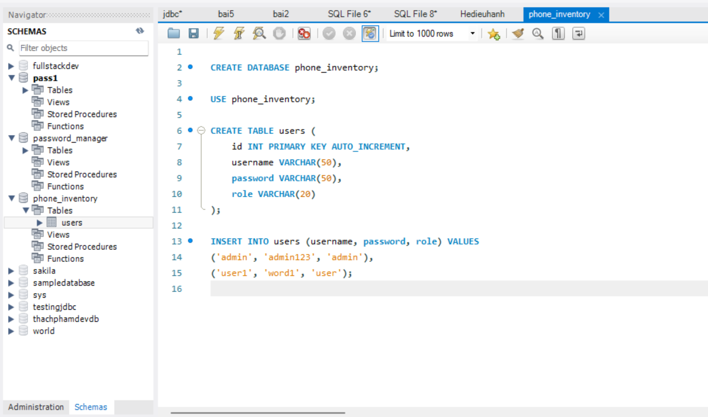


## 🌟 Tính năng nổi bật của ứng dụng
### **1. Quản lý tài khoản**
- Đăng nhập với vai trò **Admin** hoặc **User**.
- Đăng ký tài khoản mới.
- Phân quyền người dùng (Admin/User).

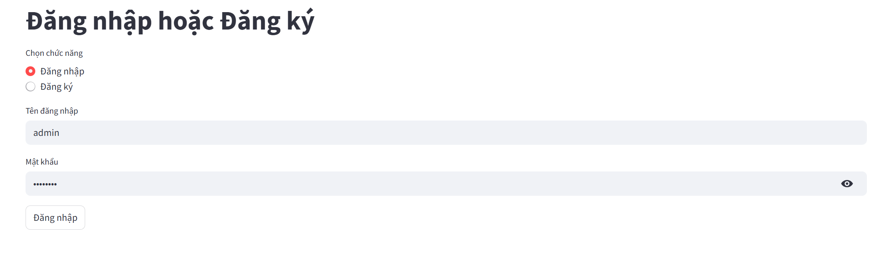
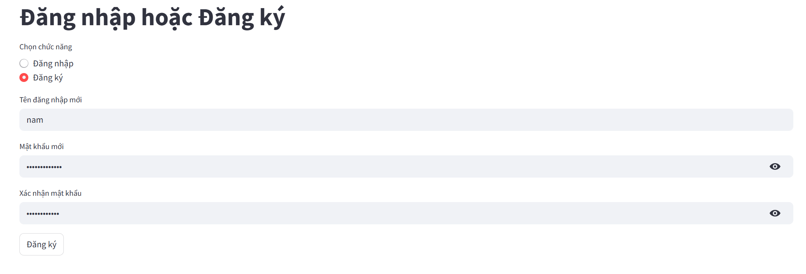


### **2. Quản lý sản phẩm**
- Thêm, sửa, xóa sản phẩm.
- Tìm kiếm sản phẩm theo tên, mã sản phẩm, hoặc thuộc tính.
- hiển thị sản phẩm
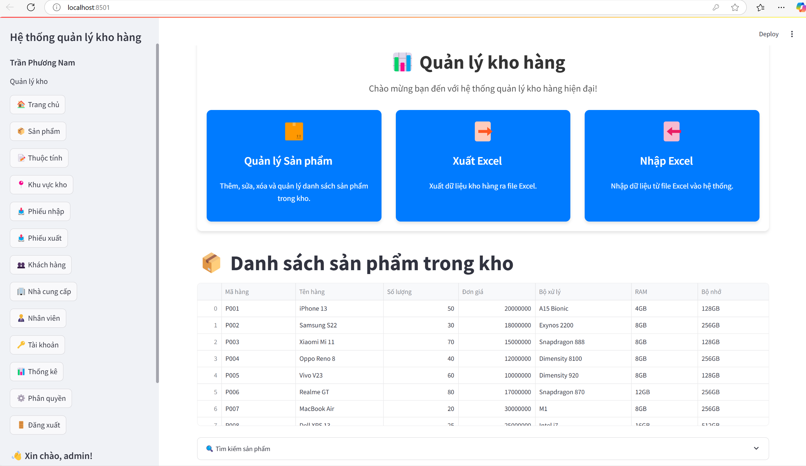
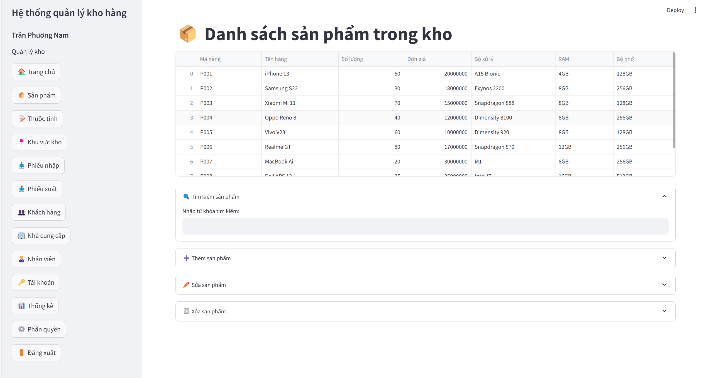
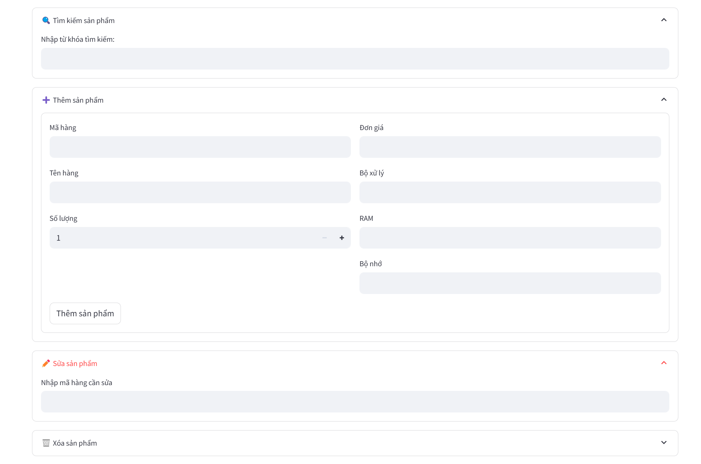


### **3. Quản lý khu vực kho**
- Quản lý khu vực lưu trữ sản phẩm.
- Theo dõi số lượng sản phẩm trong kho.
- Thêm , sửa , xóa, tìm kiếm 
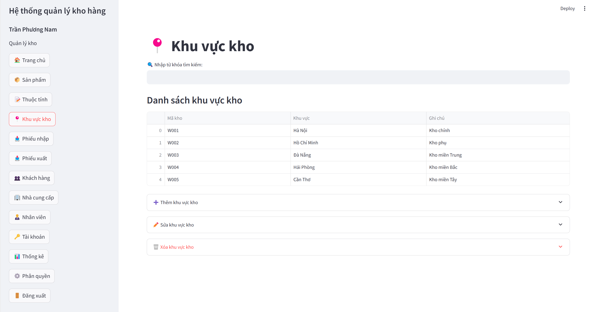


### **4. Quản lý nhập/xuất**
- Tạo phiếu nhập kho và phiếu xuất kho.
- Theo dõi lịch sử nhập/xuất sản phẩm.
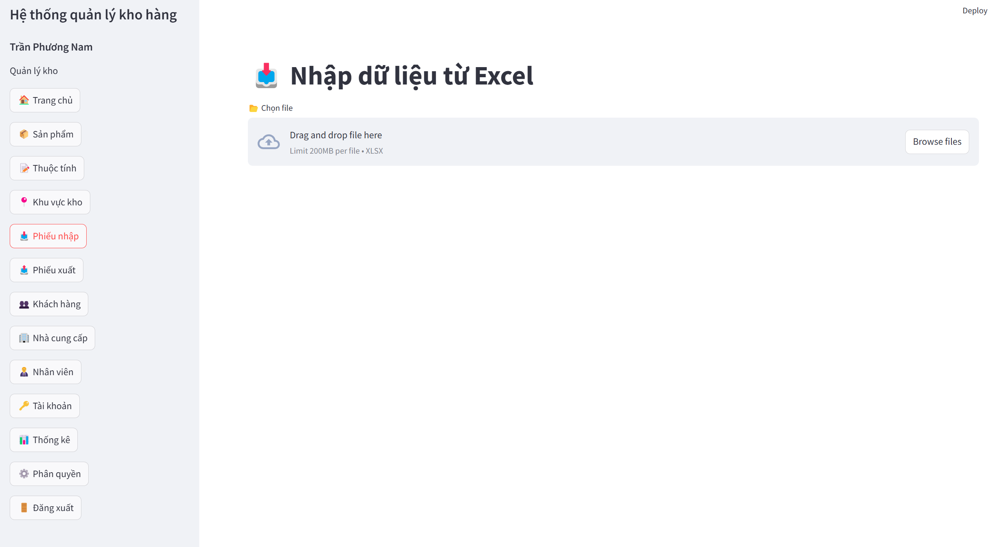
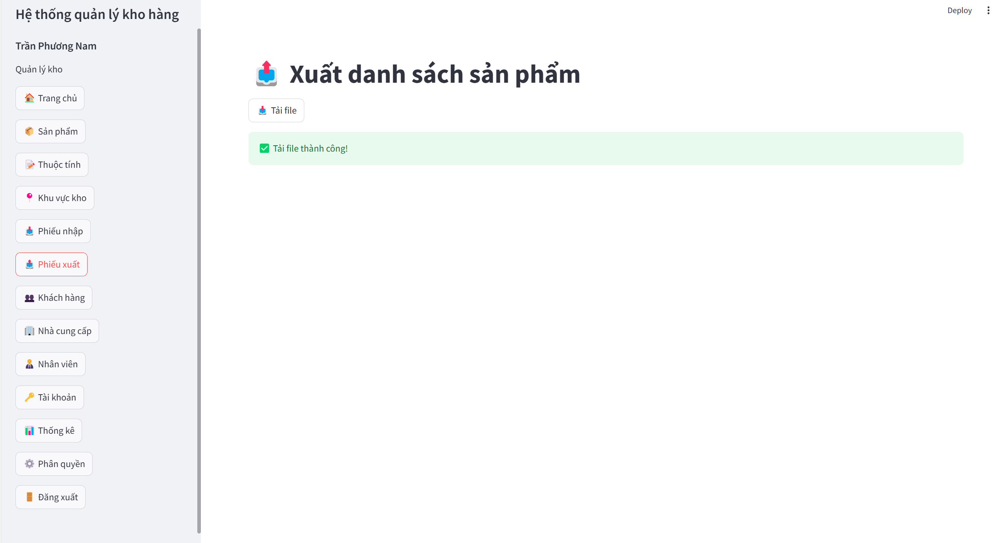

### **5. Quản lý khách hàng và nhà cung cấp**
- Thêm, sửa, xóa thông tin khách hàng.
- Quản lý danh sách nhà cung cấp.
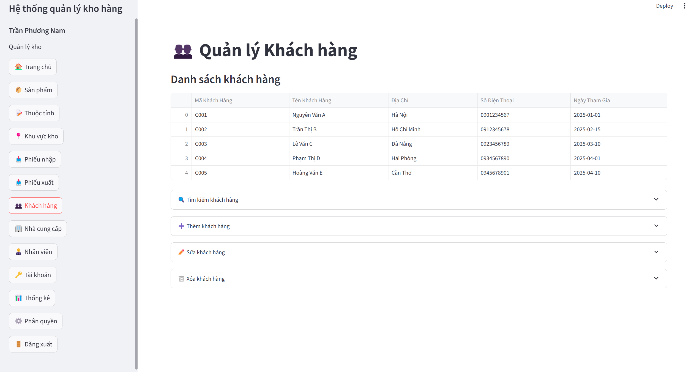
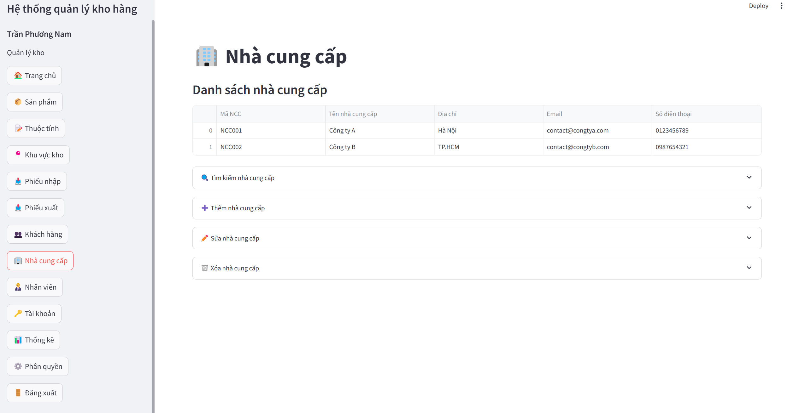

### **6 Quản lý nhân viên và tài khoản **
- Thêm, sửa, xóa thông tin nhân viên, tài khoản
- hiển thị danh sách nhân viên ,tài khỏan
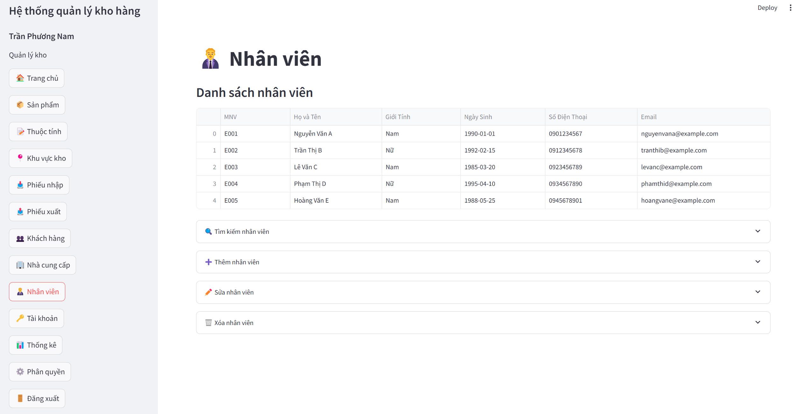
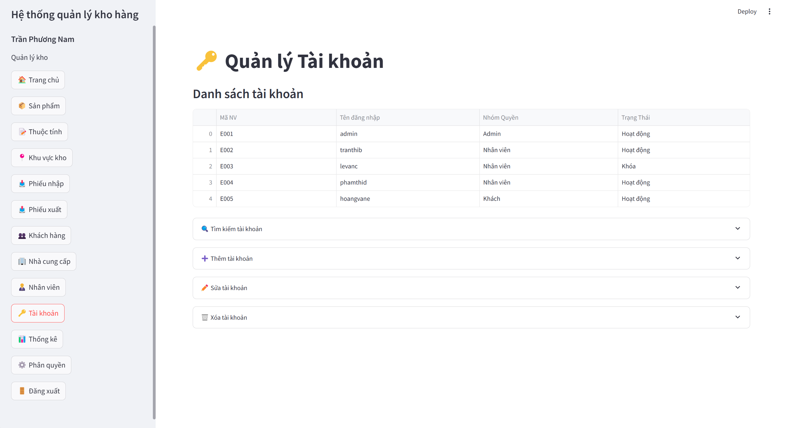

### **6. Báo cáo và thống kê**
- Thống kê số lượng sản phẩm trong kho.
- Báo cáo doanh thu và hoạt động nhập/xuất.
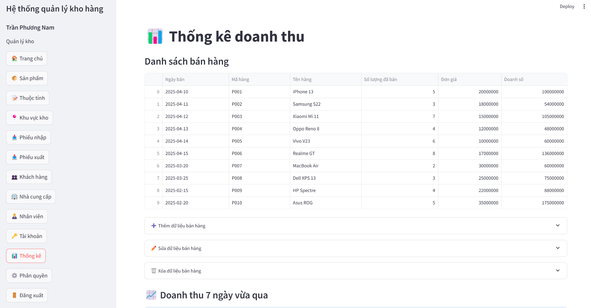
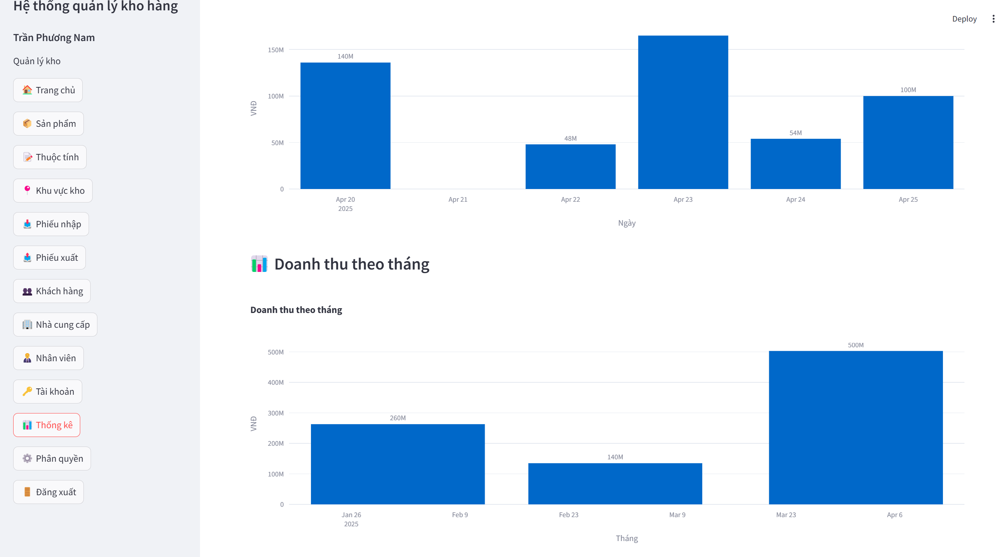

### **7. Hỗ trợ dữ liệu**
- Xuất/nhập dữ liệu dưới dạng tệp Excel.
- Tích hợp cơ sở dữ liệu MySQL để lưu trữ thông tin.
---

## 🛠️ Cài đặt
### **Yêu cầu hệ thống**
- Python 3.8 trở lên.
- MySQL đã được cài đặt và cấu hình.

### **Cài đặt thư viện**
1. Clone dự án:
   ```bash
   git clone https://github.com/your-repo/phone_inventory_app.git
   cd phone_inventory_app
   ```

2. Cài đặt các thư viện cần thiết:
   ```bash
   pip install -r requirements.txt
   ```

3. Cấu hình cơ sở dữ liệu:
   - Tạo cơ sở dữ liệu MySQL với tên `phone_inventory`.
   - Chạy các lệnh SQL trong file `data/schema.sql` để tạo bảng.

4. Chạy ứng dụng:
   ```bash
   streamlit run main.py
   ```

---


## 📂 Cấu trúc thư mục: theo kiến trúc modular
```
phone_inventory_app/
│
├── assets/                 # Tài nguyên tĩnh (hình ảnh, CSS, v.v.)
├── data/                   # Dữ liệu tĩnh và tệp nhập/xuất
├── tabs/                   # Các module giao diện (Streamlit tabs)
│   ├── login_tab.py        # Giao diện đăng nhập
│   ├── product_tab.py      # Giao diện quản lý sản phẩm
│   ├── ...                 # Các tab khác
│
├── utils/                  # Các tiện ích và xử lý logic
│   ├── db_connection.py    # Kết nối cơ sở dữ liệu
│   ├── user_queries.py     # Xử lý truy vấn liên quan đến người dùng
│   ├── ...                 # Các tiện ích khác
│
├── main.py                 # Điểm khởi chạy ứng dụng
├── requirements.txt        # Danh sách thư viện cần thiết
└── readme.md               # Tài liệu hướng dẫn
```

---

## 📧 Liên hệ
Nếu bạn có bất kỳ câu hỏi hoặc góp ý nào, vui lòng liên hệ qua email: tranphuongnam160804@gmail.com

Chúc bạn sử dụng ứng dụng hiệu quả! 🚀
# 📱 Phone Inventory Management App

Ứng dụng **Quản lý kho điện thoại** được xây dựng bằng **Python** và **Streamlit**, giúp quản lý sản phẩm, khách hàng, nhà cung cấp, và các hoạt động nhập/xuất kho một cách hiệu quả.


